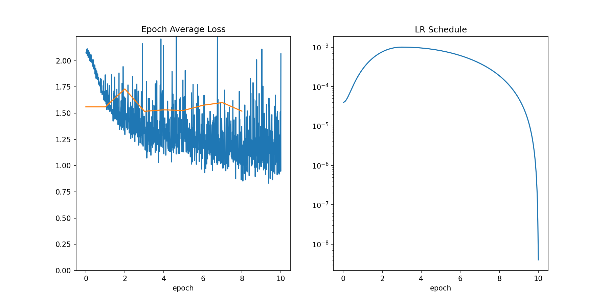
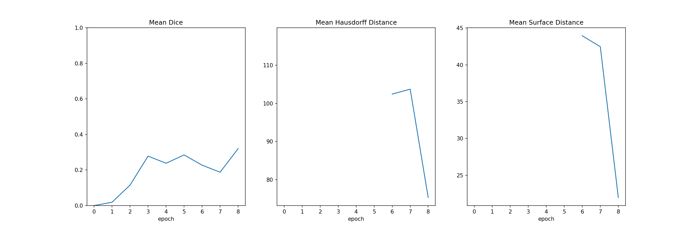
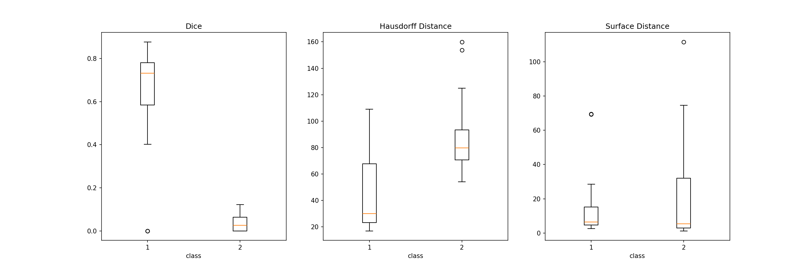
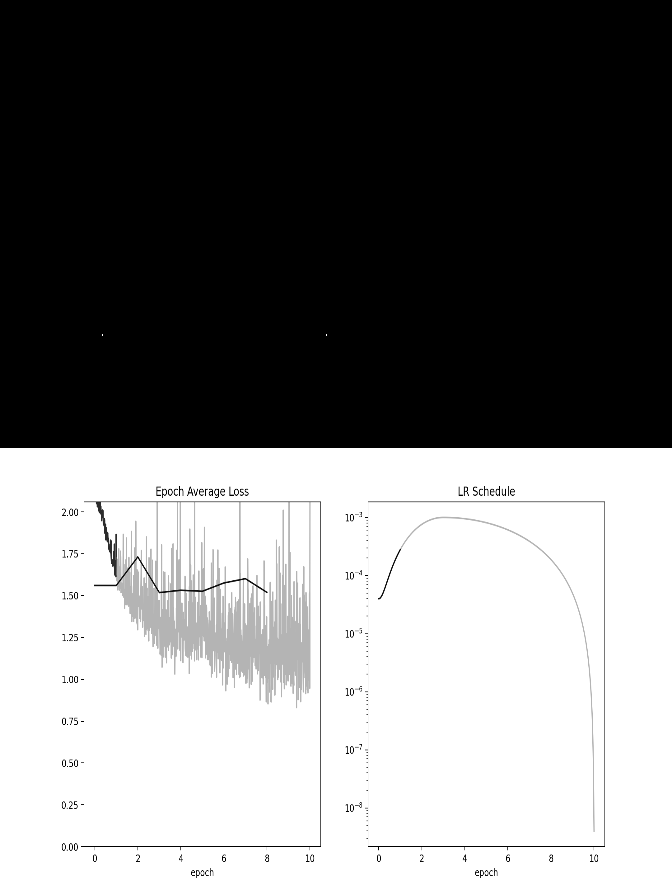

# Segmentation Report

## Loss, LR-Schedule and Key Metric

## Metrics

## Individual metrics

|               |      0 |      1 |
|:--------------|-------:|-------:|
| mean_dice     |  0.631 |  0.037 |
| mean_hausdorf | 44.229 | 88.286 |
| mean_surface  | 15.036 | 21.82  |

## Visualization of progress

